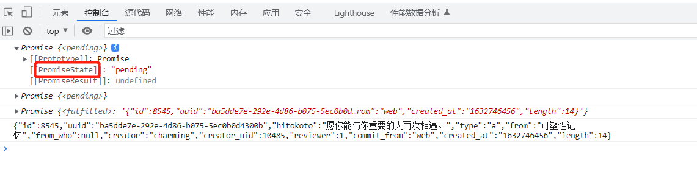

## util.promisify
https://nodejs.cn/dist/latest-v18.x/docs/api/util.html#utilpromisifyoriginal    
采用遵循常见的错误优先的回调风格的函数（也就是将 (err, value) => ... 回调作为最后一个参数），并返回一个返回 promise 的版本。

这个方法可以少写一些模板代码

```js
const util = require("util");
const fs = require("fs");

const readFile = util.promisify(fs.readFile);
readFile("./src/base/promise/test.txt").then((value) => {
  console.log(value);
});

```

## PromiseState
promise 存在状态且只能改变一次

pending -> fulfilled
pending -> rejected



## PromiseResult
保存异步任务 [成功/失败] 的值
是由 resolve 和 reject 函数修改


