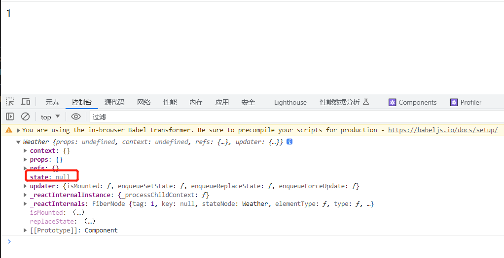

:::info
react 中有三大属性 分别为
- state
- props
- ref
:::

```js
class Weather extends React.Component {
  constructor() {
    super();
    console.log(this);
  }

  render() {
    return 1;
  }
}
```

打印下类组件 可以看到组件中的 state 属性
