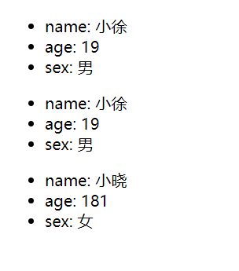

:::info
props 是组件之间传递和共享数据的一种方式
:::

## 入门

props 的简单使用

```html
<body>
  <div id="div1"></div>
  <div id="div2"></div>
  <div id="div3"></div>
  <script type="text/babel">
    class Person extends React.Component {
      render() {
        return (
          <ul>
            <li>name: {this.props.name}</li>
            <li>age: {this.props.age + 1}</li>
            <li>sex: {this.props.sex}</li>
          </ul>
        );
      }
    }

    const container1 = document.getElementById("div1");
    const container2 = document.getElementById("div2");
    const container3 = document.getElementById("div3");

    const root1 = ReactDOM.createRoot(container1);
    const root2 = ReactDOM.createRoot(container2);
    const root3 = ReactDOM.createRoot(container3);

    const person = { name: "小徐", age: 18, sex: "男" };
    //将 <MyApp/> 组件渲染到 root 根节点上
    //   babel 支持在标签对象上使用 ... 展开对象
    root1.render(<Person {...person} />);
    root2.render(<Person {...person} />);

    //   这里给18字符串会有问题
    //   root3.render(<Person name="小晓" age="18" sex="女"/>);
    root3.render(<Person name="小晓" age={18} sex="女" />);
  </script>
</body>
```



可以看到第三个 div 传递的 age 会有问题  
react 会将字符串和 1 进行相加 可以用 {} 转化为数字
