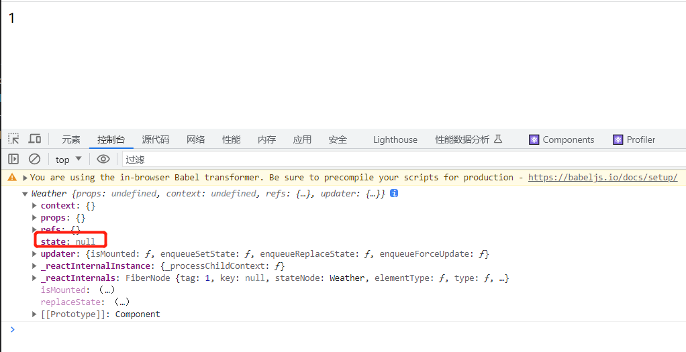

## state 是什么

:::info
state 是一个存储和管理组件内部的对象, 是组件的一部分
当 state 发生变化时，React 会自动重新渲染组件, 以确保界面和数据一致
:::

```js
class Weather extends React.Component {
  constructor() {
    super();
    console.log(this);
  }

  render() {
    return 1;
  }
}
```

打印下类组件 可以看到组件中的 state 属性


## 完整案例

显示一段文本 点击文本 切换显示内容

```html
<!DOCTYPE html>
<html>
  <head>
    <meta charset="UTF-8" />
    <title>Hello World</title>
    <script src="https://unpkg.com/react@18/umd/react.development.js"></script>
    <script src="https://unpkg.com/react-dom@18/umd/react-dom.development.js"></script>
    <script src="https://unpkg.com/@babel/standalone/babel.min.js"></script>
  </head>
  <body>
    <div id="root"></div>
    <script type="text/babel">
      class Weather extends React.Component {
        constructor() {
          // 构造器中的 this 指向实例对象
          super();
          console.log(this);
          this.state = { isHot: true };
          // 为了能让 changeWeather 方法访问到实例对象 通过 bind 去修改 changeWeather 中的 this 指向
          this.changeWeather = this.changeWeather.bind(this);
        }

        // changeWeather 放在了 Weaher 的原型对象上  供实例使用
        changeWeather() {
          // 只有通过该实例调用changeWeather
          console.log(this);
          // 只有使用 setState 能触发 render 函数重新渲染
          this.setState({ isHot: !this.state.isHot });
        }

        render() {
          return (
            // render 中 this 指向实例对象

            // 想要调用 Weather 类中的 changeWeather 方法 必须通过实例对象去调用 ，否则找不到该方法
            <h1 onClick={this.changeWeather}>
              今天天气{this.state.isHot ? "炎热" : "凉爽"}
            </h1>
          );
        }
      }

      const container = document.getElementById("root");
      const root = ReactDOM.createRoot(container);
      root.render(<Weather />);
    </script>
  </body>
</html>
```

:::tip
其中有几个问题

1. onClick 中回调函数为什么一定要用 this 调用
2. changeWeather 中为什么需要 bind 修改 this 指向
   :::

## 回调函数需要用 this 调用

看下面的例子

```js
class Person {
  speak() {
    console.log(this);
  }
  listen() {
    speak();
  }
}

const p1 = new Person();
p1.speak();
//这里的 speack()会报错
p1.listen();

```

因为 speak() 方法在 Person 对象的原型对象上 
需要 this.speak() 进行访问  
案例中同理


## 回调函数中的this指向问题
```js
      class Person {
        speak() {
          console.log(this);
        }
      }

      const p1 = new Person();
      p1.speak();

      const x = p1.speak;
      //直接调用
      x();
```
可以看到直接调用 speak 方法 this 指向 window    
案例中 changeWeather 作为 onClick 的回调    
并不是实例调用 而是直接调用的  因此需要 bind 来修改changeWeather 中的 this 指向


